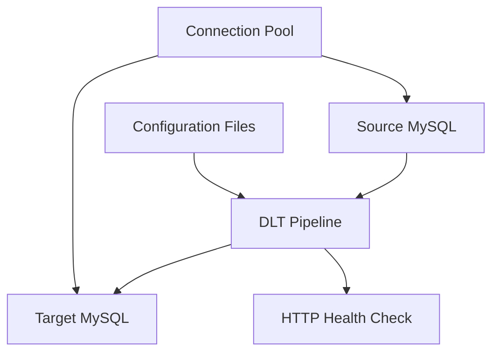

# Technical Requirements Document (TRD)
## DLT Database Sync Pipeline

### Document Information
- **Project**: DLT Database Sync Pipeline
- **Version**: 1.0
- **Date**: 2024
- **Status**: Active Development
- **Related Documents**: PRD.md, README.md

---

## 1. Technical Overview

### 1.1 Architecture Pattern
- **Pattern**: Extract-Transform-Load (ETL) Pipeline
- **Framework**: DLT (Data Load Tool) 1.8.1
- **Runtime**: Python 3.8+ with SQLAlchemy
- **Deployment**: Docker containerization with Docker Compose

### 1.2 System Components


## 2. System Architecture

### 2.1 Core Components

#### 2.1.1 Pipeline Engine (`db_pipeline.py`)
```python
# Core responsibilities:
- Database connection management
- Schema synchronization
- Incremental and full refresh sync
- Error handling and retry logic
- Connection pool monitoring
```

#### 2.1.2 Configuration Management
```json
// tables.json structure - Single Primary Key
[
  {
    "table": "table_name",
    "primary_key": "id",
    "modifier": "updated_at"  // Optional for incremental sync
  }
]

// Multiple Primary Keys (Composite Keys)
[
  {
    "table": "order_items",
    "primary_key": ["order_id", "product_id"],
    "modifier": "updated_at"
  },
  {
    "table": "user_permissions",
    "primary_key": ["user_id", "permission_id", "resource_id"]
  }
]
```

#### 2.1.3 Connection Pool Manager
```python
# SQLAlchemy engine configuration
pool_settings = {
    'pool_size': 20,           # Base connections
    'max_overflow': 30,        # Additional connections
    'pool_timeout': 60,        # Connection wait timeout
    'pool_recycle': 3600,      # Connection refresh interval
    'pool_pre_ping': True      # Connection validation
}
```

### 2.2 Data Flow Architecture

#### 2.2.1 Incremental Sync Flow
```
1. Query max(modifier_column) from target table
2. Select records WHERE modifier_column > max_value
3. Apply DLT transformations and metadata
4. Merge records using primary_key for deduplication
5. Update target table with new/changed records
```

#### 2.2.2 Full Refresh Flow
```
1. Truncate target table (or use REPLACE strategy)
2. Extract all records from source table
3. Apply DLT transformations and metadata
4. Load complete dataset to target table
5. Validate record counts and data integrity
```

## 3. Technical Requirements

### 3.1 Runtime Environment

#### 3.1.1 Python Dependencies
```python
# Core dependencies (requirements.txt)
dlt==1.8.1                    # Data Load Tool framework
mysql-connector-python        # MySQL driver
pymysql                       # Pure Python MySQL client
sqlalchemy                    # Database ORM and connection pooling
python-dotenv                 # Environment variable management
```

#### 3.1.2 System Requirements
- **Python**: 3.8+ (3.11 recommended for Docker)
- **Memory**: Minimum 512MB, Recommended 2GB
- **CPU**: 2+ cores for concurrent processing
- **Disk**: 1GB+ for logs and temporary data
- **Network**: Stable connection to source/target databases

### 3.2 Database Requirements

#### 3.2.1 Source Database (MySQL)
```sql
-- Required permissions
GRANT SELECT ON database_name.* TO 'sync_user'@'%';
GRANT SHOW DATABASES ON *.* TO 'sync_user'@'%';

-- Performance requirements
- MySQL 5.7+ or MySQL 8.0+
- InnoDB storage engine recommended
- Binary logging enabled for audit trail
- Sufficient connection limits (max_connections >= 100)
```

#### 3.2.2 Target Database (MySQL)
```sql
-- Required permissions
GRANT SELECT, INSERT, UPDATE, DELETE ON database_name.* TO 'sync_user'@'%';
GRANT CREATE, ALTER, INDEX ON database_name.* TO 'sync_user'@'%';
GRANT DROP ON database_name.* TO 'sync_user'@'%'; -- For full refresh tables

-- Schema requirements
- Compatible MySQL version with source
- Sufficient storage for replicated data
- Performance tuning for write-heavy workloads
```

### 3.3 Network Requirements

#### 3.3.1 Connectivity
- **Bandwidth**: Minimum 10Mbps for large table sync
- **Latency**: < 100ms between pipeline and databases
- **Ports**: 3306 (MySQL), 8089 (Health check)
- **Firewall**: Allow connections from pipeline to both databases

#### 3.3.2 Security
- **SSL/TLS**: Support for encrypted database connections
- **Authentication**: Username/password or certificate-based
- **Network Isolation**: VPC/subnet restrictions where applicable

## 4. Performance Specifications

### 4.1 Throughput Requirements

#### 4.1.1 Data Processing
```yaml
Small Tables (< 1K records):
  - Sync Time: < 30 seconds
  - Throughput: 1000+ records/second
  
Medium Tables (1K - 100K records):
  - Sync Time: < 5 minutes
  - Throughput: 500+ records/second
  
Large Tables (100K+ records):
  - Sync Time: < 30 minutes
  - Throughput: 100+ records/second
  - Incremental sync preferred
```

#### 4.1.2 Connection Pool Performance
```yaml
Connection Pool Metrics:
  - Pool Size: 20 base connections
  - Max Overflow: 30 additional connections
  - Total Capacity: 50 concurrent connections
  - Connection Timeout: 60 seconds
  - Pool Utilization Target: < 80%
```

### 4.2 Scalability Specifications

#### 4.2.1 Horizontal Scaling
- **Multiple Pipelines**: Support 10+ independent pipeline instances
- **Table Distribution**: Distribute tables across pipeline instances
- **Resource Isolation**: Independent connection pools per pipeline

#### 4.2.2 Vertical Scaling
- **Memory Scaling**: Linear memory usage with table count
- **CPU Scaling**: Multi-threaded processing within DLT framework
- **Connection Scaling**: Configurable pool sizes up to database limits

## 5. Implementation Details

### 5.1 Core Algorithms

#### 5.1.1 Primary Key Handling Algorithm
```python
def format_primary_key(primary_key: Union[str, List[str]]) -> str:
    """Format primary key for DLT hints."""
    if isinstance(primary_key, list):
        # For composite keys, join with comma
        return ", ".join(primary_key)
    else:
        # For single keys, return as-is
        return primary_key

def validate_primary_key_config(primary_key: Union[str, List[str]]) -> bool:
    """Validate primary key configuration."""
    if isinstance(primary_key, str):
        return bool(primary_key.strip())
    elif isinstance(primary_key, list):
        return (len(primary_key) > 0 and 
                all(isinstance(key, str) and bool(key.strip()) for key in primary_key))
    else:
        return False
```

#### 5.1.2 Incremental Sync Algorithm
```python
def incremental_sync(table_config):
    # 1. Get last sync timestamp
    max_timestamp = get_max_timestamp(
        engine_target, 
        table_config['table'], 
        table_config['modifier']
    )
    
    # 2. Configure DLT incremental source with primary key formatting
    source = sql_database(engine_source).with_resources(table_config['table'])
    
    # Format primary key for DLT (handles both single and composite keys)
    formatted_primary_key = format_primary_key(table_config['primary_key'])
    
    getattr(source, table_config['table']).apply_hints(
        primary_key=formatted_primary_key,
        incremental=dlt.sources.incremental(
            table_config['modifier'],
            initial_value=max_timestamp
        )
    )
    
    # 3. Execute sync with merge strategy
    pipeline.run(source, write_disposition="merge")
```

#### 5.1.2 Schema Synchronization Algorithm
```python
def sync_table_schema(engine_source, engine_target, table_name):
    # 1. Inspect source and target schemas
    source_columns = inspect_columns(engine_source, table_name)
    target_columns = inspect_columns(engine_target, table_name)
    
    # 2. Identify missing columns
    missing_columns = source_columns - target_columns
    
    # 3. Generate ALTER TABLE statements
    for column in missing_columns:
        alter_statements.append(f"ADD COLUMN {column.definition}")
    
    # 4. Execute schema changes
    execute_alter_statements(engine_target, table_name, alter_statements)
```

### 5.2 Error Handling Strategy

#### 5.2.1 Connection Pool Errors
```python
# QueuePool limit reached handling
try:
    with engine.connect() as connection:
        # Database operations
        pass
except sqlalchemy.exc.TimeoutError as e:
    log_error("Connection pool exhausted", e)
    # Wait and retry with exponential backoff
    time.sleep(min(30, 2 ** retry_count))
    retry_operation()
```

#### 5.2.2 Data Sync Errors
```python
# Sync operation error handling
try:
    pipeline.run(source, write_disposition="merge")
except Exception as e:
    log_error(f"Sync failed for table {table_name}", e)
    # Continue with next table
    # Schedule retry for failed table
    add_to_retry_queue(table_name, error=e)
```

### 5.3 Logging and Monitoring

#### 5.3.1 Log Format Specification
```python
# Structured logging format
log_format = "{timestamp} - {level} - {component} - {message}"

# Example log entries
"2024-01-15 10:30:45 - INFO - CONNECTION_POOL - Source pool status - Size: 20, Checked out: 5"
"2024-01-15 10:30:46 - INFO - SYNC_ENGINE - Processing incremental tables: ['users', 'orders']"
"2024-01-15 10:30:50 - ERROR - SYNC_ENGINE - QueuePool limit reached for table: products"
```

#### 5.3.2 Health Check Implementation
```python
class HealthCheckHandler(SimpleHTTPRequestHandler):
    def do_GET(self):
        # Check pipeline status
        status = {
            "status": "healthy",
            "timestamp": datetime.now().isoformat(),
            "connection_pools": {
                "source": get_pool_status(ENGINE_SOURCE),
                "target": get_pool_status(ENGINE_TARGET)
            },
            "last_sync": get_last_sync_timestamp()
        }
        
        self.send_response(200)
        self.send_header("Content-type", "application/json")
        self.end_headers()
        self.wfile.write(json.dumps(status).encode())
```

## 6. Configuration Specifications

### 6.1 Environment Variables

#### 6.1.1 Database Configuration
```bash
# Source database connection
SOURCE_DB_HOST=mysql-source.example.com
SOURCE_DB_PORT=3306
SOURCE_DB_NAME=production_db
SOURCE_DB_USER=sync_reader
SOURCE_DB_PASS=secure_password

# Target database connection
TARGET_DB_HOST=mysql-target.example.com
TARGET_DB_PORT=3307
TARGET_DB_NAME=analytics_db
TARGET_DB_USER=sync_writer
TARGET_DB_PASS=secure_password
```

#### 6.1.2 Performance Tuning
```bash
# Pipeline configuration
INTERVAL=300                  # Sync every 5 minutes
FETCH_LIMIT=1                # Batch size (1 = no batching)

# Connection pool configuration
POOL_SIZE=20                 # Base connection pool size
MAX_OVERFLOW=30              # Additional overflow connections
POOL_TIMEOUT=60              # Connection wait timeout (seconds)
POOL_RECYCLE=3600           # Connection refresh interval (seconds)
```

### 6.2 Table Configuration Schema

#### 6.2.1 JSON Schema Definition
```json
{
  "$schema": "http://json-schema.org/draft-07/schema#",
  "type": "array",
  "items": {
    "type": "object",
    "properties": {
      "table": {
        "type": "string",
        "description": "Table name to sync"
      },
      "primary_key": {
        "oneOf": [
          {
            "type": "string",
            "description": "Single primary key column for deduplication"
          },
          {
            "type": "array",
            "items": {
              "type": "string"
            },
            "minItems": 1,
            "description": "Array of columns forming a composite primary key"
          }
        ],
        "description": "Primary key configuration - can be single column or array of columns"
      },
      "modifier": {
        "type": "string",
        "description": "Column for incremental sync (optional)"
      }
    },
    "required": ["table", "primary_key"]
  }
}
```

## 7. Security Requirements

### 7.1 Authentication & Authorization

#### 7.1.1 Database Security
```sql
-- Principle of least privilege
-- Source database (read-only)
CREATE USER 'dlt_reader'@'%' IDENTIFIED BY 'strong_password';
GRANT SELECT ON source_db.* TO 'dlt_reader'@'%';

-- Target database (read-write)
CREATE USER 'dlt_writer'@'%' IDENTIFIED BY 'strong_password';
GRANT SELECT, INSERT, UPDATE, DELETE, CREATE, ALTER ON target_db.* TO 'dlt_writer'@'%';
```

#### 7.1.2 Credential Management
```bash
# Environment-based credential management
# Never store credentials in code or version control
# Use Docker secrets or external secret management
echo "DB_PASSWORD" | docker secret create db_password -
```

### 7.2 Network Security

#### 7.2.1 Connection Encryption
```python
# SSL/TLS connection configuration
DB_URL = f"mysql://{user}:{password}@{host}:{port}/{database}?ssl_mode=REQUIRED"

# Certificate-based authentication (optional)
engine = create_engine(DB_URL, connect_args={
    "ssl": {
        "ssl_ca": "/path/to/ca-cert.pem",
        "ssl_cert": "/path/to/client-cert.pem",
        "ssl_key": "/path/to/client-key.pem"
    }
})
```

## 8. Testing Requirements

### 8.1 Unit Testing

#### 8.1.1 Test Coverage Requirements
```python
# Minimum test coverage targets
- Connection pool management: 90%
- Schema synchronization: 95%
- Data transformation logic: 90%
- Error handling: 85%
- Configuration parsing: 95%
```

#### 8.1.2 Test Categories
```python
# Unit test structure
tests/
├── unit/
│   ├── test_connection_pool.py
│   ├── test_schema_sync.py
│   ├── test_incremental_logic.py
│   └── test_configuration.py
├── integration/
│   ├── test_mysql_integration.py
│   ├── test_docker_deployment.py
│   └── test_end_to_end_sync.py
└── performance/
    ├── test_large_table_sync.py
    ├── test_connection_pool_limits.py
    └── test_concurrent_operations.py
```

### 8.2 Integration Testing

#### 8.2.1 Database Integration Tests
```python
# Test scenarios
def test_incremental_sync_with_updates():
    # 1. Insert initial data
    # 2. Run incremental sync
    # 3. Update source data
    # 4. Run sync again
    # 5. Verify only updated records synced

def test_schema_evolution():
    # 1. Sync table with initial schema
    # 2. Add column to source table
    # 3. Run sync again
    # 4. Verify column added to target
```

### 8.3 Performance Testing

#### 8.3.1 Load Testing Scenarios
```yaml
Test Scenarios:
  - Small Table Sync: 1K records, measure time and memory
  - Medium Table Sync: 100K records, monitor connection usage
  - Large Table Sync: 1M+ records, test incremental performance
  - Concurrent Sync: Multiple tables simultaneously
  - Connection Pool Stress: Exhaust and recover from pool limits
```

## 9. Deployment Requirements

### 9.1 Docker Configuration

#### 9.1.1 Dockerfile Requirements
```dockerfile
# Multi-stage build for production
FROM python:3.11-slim as builder
WORKDIR /app
COPY requirements.txt .
RUN pip install --no-cache-dir -r requirements.txt

FROM python:3.11-slim
WORKDIR /app
COPY --from=builder /usr/local/lib/python3.11/site-packages /usr/local/lib/python3.11/site-packages
COPY source/ .
EXPOSE 8089
CMD ["python", "db_pipeline.py"]
```

#### 9.1.2 Docker Compose Services
```yaml
version: '3.8'
services:
  dlt_pipeline:
    build: .
    environment:
      - SOURCE_DB_HOST=mysql_source
      - TARGET_DB_HOST=mysql_target
    depends_on:
      - mysql_source
      - mysql_target
    ports:
      - "8089:8089"
    restart: unless-stopped
    healthcheck:
      test: ["CMD", "curl", "-f", "http://localhost:8089"]
      interval: 30s
      timeout: 10s
      retries: 3
```

### 9.2 CI/CD Integration

#### 9.2.1 GitLab CI Pipeline
```yaml
stages:
  - test
  - build
  - deploy

test:
  stage: test
  script:
    - pip install -r requirements.txt
    - python -m pytest tests/ --cov=source/
    - coverage report --fail-under=85

deploy_production:
  stage: deploy
  script:
    - docker compose up -d --build --force-recreate
  only:
    - tags
```

## 10. Monitoring & Observability

### 10.1 Metrics Collection

#### 10.1.1 System Metrics
```python
# Key performance indicators
metrics = {
    "sync_duration_seconds": histogram,
    "records_processed_total": counter,
    "connection_pool_size": gauge,
    "connection_pool_checked_out": gauge,
    "sync_errors_total": counter,
    "table_sync_success_rate": gauge
}
```

#### 10.1.2 Health Check Endpoints
```python
# Health check response format
{
    "status": "healthy|degraded|unhealthy",
    "timestamp": "2024-01-15T10:30:45Z",
    "version": "1.0.0",
    "uptime_seconds": 3600,
    "database_connections": {
        "source": {"status": "connected", "pool_size": 20, "checked_out": 5},
        "target": {"status": "connected", "pool_size": 20, "checked_out": 3}
    },
    "last_successful_sync": "2024-01-15T10:25:30Z",
    "tables_synced": 15,
    "sync_errors": 0
}
```

## 11. Maintenance & Operations

### 11.1 Operational Procedures

#### 11.1.1 Routine Maintenance
```bash
# Daily operations checklist
1. Check pipeline health status
2. Review sync performance logs
3. Monitor connection pool utilization
4. Validate data consistency samples
5. Check disk space and log rotation

# Weekly operations
1. Review error logs and trends
2. Performance optimization review
3. Database connection audit
4. Configuration backup verification
```

#### 11.1.2 Troubleshooting Procedures
```bash
# Common issue resolution
1. Connection Pool Exhaustion:
   - Check POOL_SIZE and MAX_OVERFLOW settings
   - Review long-running queries
   - Restart pipeline if necessary

2. Sync Performance Issues:
   - Analyze table sizes and sync times
   - Consider incremental sync for large tables
   - Optimize database indexes

3. Schema Sync Failures:
   - Verify database permissions
   - Check column compatibility
   - Review ALTER TABLE logs
```

---

**Document Owner**: Development Team  
**Technical Lead**: Senior Engineer  
**Last Updated**: 2024  
**Next Review**: Monthly 