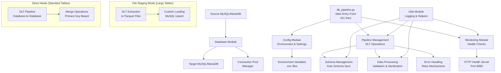

# Technical Requirements Document (TRD)
## DLT Database Sync Pipeline

### Document Information
- **Project**: DLT Database Sync Pipeline
- **Version**: 2.1
- **Date**: 2024-2025
- **Status**: Production Ready with Modular Architecture
- **Architecture**: Modular Design (97% code reduction from monolithic structure)
- **Related Documents**: PRD.md, README.md, workflow.md

---

## 1. Technical Overview

### 1.1 Architecture Pattern
- **Pattern**: Modular Extract-Transform-Load (ETL) Pipeline with Advanced Error Handling
- **Architecture**: Clean modular design with separated concerns (9 specialized modules)
- **Framework**: DLT (Data Load Tool) 1.15.0+ with SQLAlchemy and PyMySQL
- **Runtime**: Python 3.8+ with SQLAlchemy (3.11 recommended for Docker)
- **Deployment**: Docker containerization with Docker Compose and CI/CD integration
- **Processing Modes**: Direct database sync and file-based staging for large tables
- **Error Handling**: Multi-layered error recovery and automatic retry mechanisms
- **Code Reduction**: 97% reduction from monolithic structure (3,774 → 161 lines main file)

### 1.2 System Components


## 2. System Architecture

### 2.1 Core Components

#### 2.1.1 Modular Pipeline Architecture
The system has been refactored into a clean modular architecture with separated concerns:

**Main Entry Point (`db_pipeline.py`)** - 161 lines (97% reduction from 3,774 lines)
```python
# Core responsibilities:
- Application orchestration and lifecycle management
- Configuration validation and startup procedures
- Signal handling and graceful shutdown
- Background service management (HTTP server, monitoring)
- Main execution loop coordination
```

**Specialized Modules:**
- **`config.py`** (91 lines) - Configuration management and environment variables
- **`database.py`** (141 lines) - Connection pools and transaction handling
- **`error_handling.py`** (207 lines) - Multi-layered retry mechanisms and recovery
- **`data_processing.py`** (299 lines) - Data validation, sanitization, and debugging
- **`schema_management.py`** (114 lines) - Schema synchronization and column management
- **`pipeline_management.py`** (349 lines) - DLT operations and table processing orchestration
- **`monitoring.py`** (184 lines) - Health checks and performance monitoring
- **`utils.py`** (104 lines) - Logging utilities and common helper functions
- **`index_management.py`** (New) - Database index optimization for DLT operations

#### 2.1.2 Module Responsibilities

**Configuration Module (`config.py`)**
```python
# Responsibilities:
- Environment variable loading and validation with defaults
- Database connection URL construction with URL encoding
- Global constants and settings management
- Table configuration loading from JSON with validation
- Pipeline mode configuration (direct vs file_staging)
- Connection pool settings optimization for MariaDB
- Batch processing and performance tuning parameters
```

**Database Module (`database.py`)**
```python
# Responsibilities:
- SQLAlchemy engine creation and management
- Connection pool optimization and monitoring
- Transaction management with semaphore control
- DLT column management (ensure _dlt_* columns)
- Graceful connection cleanup and disposal
```

**Error Handling Module (`error_handling.py`)**
```python
# Responsibilities:
- Connection error retry with exponential backoff
- Lock timeout and deadlock recovery
- JSON serialization error handling
- DLT state corruption recovery
- Connection loss detection and recovery
```

**Data Processing Module (`data_processing.py`)**
```python
# Responsibilities:
- Data validation and sanitization
- JSON serialization error prevention
- Problematic data debugging and analysis
- DLT transformer for data cleaning
- Decimal, datetime, and NULL byte handling
```

**Schema Management Module (`schema_management.py`)**
```python
# Responsibilities:
- Schema synchronization between source and target
- Column addition and type validation
- Table existence checking
- Primary key validation
- Row count verification
```

**Pipeline Management Module (`pipeline_management.py`)**
```python
# Responsibilities:
- DLT pipeline creation and configuration
- Table batch processing and orchestration
- Incremental and full refresh sync logic
- Table cleanup and optimization
- Performance metrics and reporting
```

**Monitoring Module (`monitoring.py`)**
```python
# Responsibilities:
- HTTP health check server
- Connection pool monitoring
- Long-running query detection and termination
- Performance metrics collection
- Real-time status reporting
```

**Utilities Module (`utils.py`)**
```python
# Responsibilities:
- Structured logging with timestamps
- Primary key formatting and validation
- JSON debugging and safe operations
- Common helper functions
- Configuration validation utilities
```

#### 2.1.3 Enhanced Table Configuration
```json
// Enhanced table configuration with advanced features
[
  {
    "table": "table_name",
    "primary_key": "id",  // Single primary key
    "modifier": "updated_at"  // Optional for incremental sync
  },
  {
    "table": "order_items",
    "primary_key": ["order_id", "product_id"],  // Composite primary key
    "modifier": "updated_at"
  },
  {
    "table": "user_permissions",
    "primary_key": ["user_id", "permission_id", "resource_id", "tenant_id"]  // Complex composite key
  }
]
```

#### 2.1.4 Advanced Connection Pool Manager
```python
# Enhanced SQLAlchemy engine configuration with monitoring
pool_settings = {
    'pool_size': int(os.getenv('POOL_SIZE', 20)),           # Configurable base connections
    'max_overflow': int(os.getenv('MAX_OVERFLOW', 30)),     # Configurable overflow limit
    'pool_timeout': int(os.getenv('POOL_TIMEOUT', 60)),     # Configurable connection wait timeout
    'pool_recycle': int(os.getenv('POOL_RECYCLE', 3600)),   # Configurable connection refresh interval
    'pool_pre_ping': True,                                  # Connection validation before use
}

# MySQL-specific connection arguments for stability
mysql_connect_args = {
    'connect_timeout': 60,
    'read_timeout': 300,
    'write_timeout': 300,
    'autocommit': False,  # Better transaction control
    'charset': 'utf8mb4',
    'init_command': "SET sql_mode=(SELECT REPLACE(@@sql_mode,'ONLY_FULL_GROUP_BY','')); SET SESSION innodb_lock_wait_timeout=120; SET SESSION lock_wait_timeout=120",
    'use_unicode': True,
}
```

### 2.2 Data Flow Architecture

#### 2.2.1 Enhanced Incremental Sync Flow
```
Direct Mode (PIPELINE_MODE=direct):
1. Query max(modifier_column) from target table with lock timeout handling
2. Select records WHERE modifier_column > max_value with data validation
3. Apply data sanitization for problematic values (Decimal, NULL bytes, invalid dates)
4. Apply DLT transformations and metadata with error handling
5. Merge records using primary_key for deduplication (single or composite keys)
6. Update target table with new/changed records using optimized merge operations
7. Handle errors with automatic retry and fallback mechanisms

File Staging Mode (PIPELINE_MODE=file_staging):
1. DLT extracts incremental data to Parquet files (avoids database conflicts)
2. Files processed in memory-efficient chunks (10k records per chunk)
3. Custom MySQL upsert operations (INSERT...ON DUPLICATE KEY UPDATE)
4. No DELETE operations = No lock timeouts for large tables
5. Automatic state management via DLT for incremental tracking
6. Handles tables of any size without timeout issues
```

#### 2.2.2 Full Refresh Flow with Optimization
```
1. Pre-cleanup tables using force_table_clear to prevent complex DELETE operations
2. Extract all records from source table with data validation
3. Apply DLT transformations and metadata with sanitization
4. Load complete dataset to target table using replace strategy
5. Validate record counts and data integrity
6. Clean up staging files and temporary data
```

#### 2.2.3 File-based Staging Flow
```
1. Extract data to Parquet files in staging directory
2. Apply compression (Snappy, Gzip, Brotli) for storage efficiency
3. Process staged files to avoid database conflicts
4. Load processed data to target database
5. Clean up staging files based on retention policy
6. Monitor staging directory usage and performance
```

## 3. Technical Requirements

### 3.1 Runtime Environment

#### 3.1.1 Python Dependencies
```python
# Core dependencies with version specifications
dlt[sqlalchemy]>=1.15.0        # Data Load Tool framework with SQLAlchemy support
pymysql>=1.1.0                 # Primary MySQL driver for stability and compatibility
sqlalchemy>=1.4.0             # Database ORM and advanced connection pooling
python-dotenv>=1.0.0          # Environment variable management
pandas>=1.5.0                 # Data manipulation and analysis
pyarrow>=10.0.0               # Parquet file handling and optimization
watchdog>=3.0.0               # File system monitoring for staging
setuptools<81                 # Package management compatibility

# Enhanced features
orjson>=3.9.0                 # High-performance JSON processing
alive-progress>=2.4.0         # Progress bars for better user experience
humanize>=4.0.0               # Human-readable numbers and time formatting
pytz>=2023.3                  # Timezone handling for accurate timestamp comparisons
```

#### 3.1.2 System Requirements
- **Python**: 3.8+ (3.11 recommended for Docker)
- **Memory**: Minimum 512MB, Recommended 2GB
- **CPU**: 2+ cores for concurrent processing
- **Disk**: 1GB+ for logs, staging files, and temporary data
- **Network**: Stable connection to source/target databases
- **Timezone**: Asia/Jakarta timezone support

### 3.2 Database Requirements

#### 3.2.1 Source Database (MySQL)
```sql
-- Enhanced permissions for advanced features
GRANT SELECT ON database_name.* TO 'sync_user'@'%';
GRANT SHOW DATABASES ON *.* TO 'sync_user'@'%';
GRANT PROCESS ON *.* TO 'sync_user'@'%';  -- For query monitoring

-- Performance and compatibility requirements
- MySQL 5.7+ or MySQL 8.0+ (8.0+ recommended)
- InnoDB storage engine required
- Binary logging enabled for audit trail
- Sufficient connection limits (max_connections >= 100)
- Optimized innodb_lock_wait_timeout and lock_wait_timeout
- Support for JSON columns and advanced data types
```

#### 3.2.2 Target Database (MySQL)
```sql
-- Enhanced permissions for advanced operations
GRANT SELECT, INSERT, UPDATE, DELETE ON database_name.* TO 'sync_user'@'%';
GRANT CREATE, ALTER, INDEX, DROP ON database_name.* TO 'sync_user'@'%';
GRANT PROCESS ON *.* TO 'sync_user'@'%';  -- For query monitoring and cleanup

-- Schema and performance requirements
- Compatible MySQL version with source (5.7+ recommended)
- Sufficient storage for replicated data and staging
- Performance tuning for write-heavy workloads
- Support for temporary tables and staging schemas
- Optimized transaction isolation levels
```

### 3.3 Network Requirements

#### 3.3.1 Connectivity
- **Bandwidth**: Minimum 10Mbps for large table sync
- **Latency**: < 100ms between pipeline and databases
- **Ports**: 3306 (MySQL), 8089 (Health check)
- **Firewall**: Allow connections from pipeline to both databases
- **SSL/TLS**: Support for encrypted database connections

#### 3.3.2 Security
- **SSL/TLS**: Support for encrypted database connections
- **Authentication**: Username/password or certificate-based
- **Network Isolation**: VPC/subnet restrictions where applicable
- **Credential Management**: Environment-based secure configuration

## 4. Performance Specifications

### 4.1 Throughput Requirements

#### 4.1.1 Data Processing with Batching
```yaml
Small Tables (< 1K records):
  - Sync Time: < 30 seconds
  - Throughput: 1000+ records/second
  - Batch Size: Configurable (default: 8 tables per batch)

Medium Tables (1K - 100K records):
  - Sync Time: < 5 minutes
  - Throughput: 500+ records/second
  - Batch Size: Configurable (default: 4-6 tables per batch)

Large Tables (100K+ records) - Direct Mode:
  - Sync Time: < 30 minutes (may timeout on 15GB+ tables)
  - Throughput: 100+ records/second
  - Batch Size: Configurable (default: 2-3 tables per batch)
  - Incremental sync with DLT merge operations

Large Tables (Any Size) - File Staging Mode:
  - Sync Time: Consistent performance regardless of table size
  - Throughput: 100+ records/second with chunked processing
  - Memory Usage: 10k records per chunk (scalable)
  - No Timeout Issues: Avoids DLT's problematic DELETE operations
  - Processing: DLT extraction + Custom MySQL upsert loading
```

#### 4.1.2 Enhanced Connection Pool Performance
```yaml
Connection Pool Metrics:
  - Pool Size: Configurable (default: 20 base connections)
  - Max Overflow: Configurable (default: 30 additional connections)
  - Total Capacity: 50+ concurrent connections
  - Connection Timeout: Configurable (default: 60 seconds)
  - Pool Utilization Target: < 80%
  - Connection Monitoring: Real-time status and alerts
  - Automatic Recovery: Connection reset on failures
```

### 4.2 Scalability Specifications

#### 4.2.1 Horizontal Scaling
- **Multiple Pipelines**: Support 10+ independent pipeline instances
- **Table Distribution**: Distribute tables across pipeline instances
- **Resource Isolation**: Independent connection pools per pipeline
- **Load Balancing**: Distribute load across multiple instances

#### 4.2.2 Vertical Scaling
- **Memory Scaling**: Linear memory usage with table count
- **CPU Scaling**: Multi-threaded processing within DLT framework
- **Connection Scaling**: Configurable pool sizes up to database limits
- **Batch Scaling**: Configurable batch sizes for optimal performance

## 5. Implementation Details

### 5.1 Modular Architecture Benefits

#### 5.1.1 Code Organization Improvements
```python
# Before Refactoring:
- Single file: db_pipeline.py (3,774 lines, 182KB)
- Monolithic structure with mixed concerns
- Difficult to maintain and test
- Complex interdependencies

# After Refactoring:
- Main entry point: db_pipeline.py (161 lines, 5.6KB) - 97% reduction
- 8 specialized modules (total ~67KB)
- Clear separation of concerns
- Easy to test and maintain
- Minimal circular dependencies
```

#### 5.1.2 Import Strategy
```python
# Centralized configuration access
import config

# Module-specific imports
from database import create_engines, get_engines
from pipeline_management import load_select_tables_from_database
from monitoring import run_http_server, periodic_connection_monitoring
from error_handling import retry_on_connection_error
```

#### 5.1.3 Maintainability Improvements
- **Single Responsibility**: Each module has a clear, focused purpose
- **Testability**: Individual modules can be unit tested in isolation
- **Readability**: Smaller, focused files are easier to understand
- **Extensibility**: New features can be added without modifying existing modules
- **Debugging**: Issues can be isolated to specific modules

### 5.2 Core Algorithms

#### 5.2.1 Enhanced Primary Key Handling Algorithm
```python
def format_primary_key(primary_key: Union[str, List[str]]) -> str:
    """Format primary key for DLT hints with validation."""
    if isinstance(primary_key, list):
        # For composite keys, join with comma and validate
        if not all(isinstance(key, str) and key.strip() for key in primary_key):
            raise ValueError(f"Invalid primary key configuration: {primary_key}")
        return ", ".join(primary_key)
    else:
        # For single keys, validate and return
        if not isinstance(primary_key, str) or not primary_key.strip():
            raise ValueError(f"Invalid primary key configuration: {primary_key}")
        return primary_key

def validate_primary_key_config(primary_key: Union[str, List[str]]) -> bool:
    """Enhanced validation of primary key configuration."""
    try:
        if isinstance(primary_key, str):
            return bool(primary_key.strip())
        elif isinstance(primary_key, list):
            return (len(primary_key) > 0 and 
                    all(isinstance(key, str) and bool(key.strip()) for key in primary_key))
        else:
            return False
    except Exception:
        return False
```

#### 5.2.2 Advanced Incremental Sync Algorithm
```python
def incremental_sync_with_optimization(table_config):
    # 1. Get last sync timestamp with error handling
    max_timestamp = get_max_timestamp_with_retry(
        engine_target, 
        table_config['table'], 
        table_config['modifier']
    )
    
    # 2. Configure DLT incremental source with primary key formatting
    source = sql_database(engine_source).with_resources(table_config['table'])
    
    # Format primary key for DLT (handles both single and composite keys)
    formatted_primary_key = format_primary_key(table_config['primary_key'])
    
    # Apply hints with error handling
    try:
        getattr(source, table_config['table']).apply_hints(
            primary_key=formatted_primary_key,
            incremental=dlt.sources.incremental(
                table_config['modifier'],
                initial_value=max_timestamp
            )
        )
    except Exception as hint_error:
        log(f"Error applying hints for {table_config['table']}: {hint_error}")
        # Fallback to basic configuration
    
    # 3. Execute sync with merge strategy and error recovery
    try:
        pipeline.run(source, write_disposition="merge")
    except Exception as sync_error:
        # Handle specific error types with appropriate recovery
        handle_sync_error(sync_error, table_config)
```

#### 5.2.3 Enhanced Schema Synchronization Algorithm
```python
def sync_table_schema_with_validation(engine_source, engine_target, table_name):
    """Enhanced schema sync with validation and error handling."""
    def _sync_schema(connection):
        inspector_source = sa.inspect(engine_source)
        inspector_target = sa.inspect(engine_target)
        
        source_columns = {col["name"]: col for col in inspector_source.get_columns(table_name)}
        target_columns = {col["name"] for col in inspector_target.get_columns(table_name)}
        
        alter_statements = []
        for column_name, column_info in source_columns.items():
            if column_name not in target_columns:
                column_type = column_info["type"]
                # Validate column type compatibility
                if is_column_type_compatible(column_type):
                    alter_statements.append(f"ADD COLUMN `{column_name}` {column_type}")
                else:
                    log(f"Warning: Incompatible column type for {column_name}: {column_type}")
        
        if alter_statements:
            alter_query = f"ALTER TABLE {table_name} {', '.join(alter_statements)};"
            log(f"Syncing schema for {table_name}: {alter_query}")
            connection.execute(sa.text(alter_query))
            return True
        return False
    
    return execute_with_transaction_management(
        engine_target, 
        f"sync_table_schema for {table_name}", 
        _sync_schema
    )
```

### 5.3 Advanced Error Handling Strategy

#### 5.3.1 Multi-layered Error Recovery
```python
def handle_sync_error(error, table_config):
    """Comprehensive error handling with automatic recovery."""
    error_message = str(error).lower()

    # Connection-related errors
    if any(keyword in error_message for keyword in ['connection lost', 'server has gone away']):
        log(f"Connection error detected for {table_config['table']}")
        return handle_connection_error(table_config)

    # Lock timeout and deadlock errors
    elif any(keyword in error_message for keyword in ['lock wait timeout', 'deadlock']):
        log(f"Lock timeout detected for {table_config['table']}")
        return handle_lock_timeout_error(table_config)

    # JSON serialization errors with data sanitization
    elif any(keyword in error_message for keyword in ['jsondecodeerror', 'orjson']):
        log(f"JSON error detected for {table_config['table']}")
        return handle_json_error_with_sanitization(table_config)

    # DLT state corruption errors
    elif any(keyword in error_message for keyword in ['decompress_state', 'load_pipeline_state']):
        log(f"DLT state corruption detected for {table_config['table']}")
        return handle_state_corruption_error(table_config)

    # Connection pool exhaustion
    elif any(keyword in error_message for keyword in ['queuepool limit reached']):
        log(f"Connection pool exhausted for {table_config['table']}")
        return handle_connection_pool_error(table_config)

    # Unknown errors
    else:
        log(f"Unknown error for {table_config['table']}: {error}")
        return False
```

#### 5.3.2 Enhanced Data Sanitization
```python
def sanitize_table_data(records, table_name):
    """Enhanced data sanitization for JSON compatibility."""
    sanitized_count = 0

    for record in records:
        # Convert Decimal objects to float
        for key, value in record.items():
            if isinstance(value, Decimal):
                record[key] = float(value)
                sanitized_count += 1

        # Remove NULL bytes that break JSON
        for key, value in record.items():
            if isinstance(value, str) and '\x00' in value:
                record[key] = value.replace('\x00', '')
                sanitized_count += 1

        # Handle invalid dates
        for key, value in record.items():
            if isinstance(value, str) and value == '0000-00-00 00:00:00':
                record[key] = None
                sanitized_count += 1

    if sanitized_count > 0:
        log(f"Data sanitization applied to {sanitized_count} values in {table_name}")

    return records
```

#### 5.3.2 Connection Pool Error Handling
```python
def handle_connection_pool_error(engine, db_type="unknown"):
    """Enhanced connection pool error handling with automatic recovery."""
    try:
        # Check pool status
        pool_size = engine.pool.size()
        checked_out = engine.pool.checkedout()
        overflow = engine.pool.overflow()
        
        log(f"Connection pool status for {db_type}: Size={pool_size}, Checked out={checked_out}, Overflow={overflow}")
        
        # If pool is exhausted, wait and retry
        if checked_out >= pool_size + overflow:
            log(f"Connection pool exhausted for {db_type}, waiting for available connections...")
            time.sleep(30)
            return True
        
        # If too many connections checked out, log warning
        if checked_out > pool_size * 0.8:
            log(f"High connection usage for {db_type}: {checked_out}/{pool_size}")
        
        return True
        
    except Exception as pool_error:
        log(f"Error checking connection pool for {db_type}: {pool_error}")
        return False
```

### 5.4 Enhanced Logging and Monitoring

#### 5.4.1 Structured Logging Format
```python
# Enhanced structured logging with context
log_format = "{timestamp} - {level} - {component} - {operation} - {message}"

# Example log entries with enhanced context
"2024-01-15 10:30:45 - INFO - CONNECTION_POOL - MONITORING - Source pool status - Size: 20, Checked out: 5, Overflow: 0"
"2024-01-15 10:30:46 - INFO - SYNC_ENGINE - BATCH_PROCESSING - Processing incremental tables: ['users', 'orders'] in batch 1/3"
"2024-01-15 10:30:50 - ERROR - SYNC_ENGINE - ERROR_RECOVERY - QueuePool limit reached for table: products, attempting recovery"
"2024-01-15 10:30:55 - INFO - ERROR_RECOVERY - SUCCESS - Successfully recovered from connection pool exhaustion"
```

#### 5.4.2 Enhanced Health Check Implementation
```python
class EnhancedHealthCheckHandler(SimpleHTTPRequestHandler):
    def do_GET(self):
        # Enhanced health check with comprehensive status
        try:
            status = {
                "status": "healthy",
                "timestamp": datetime.now().isoformat(),
                "version": "2.0.0",
                "uptime_seconds": get_uptime_seconds(),
                "database_connections": {
                    "source": get_enhanced_pool_status(ENGINE_SOURCE),
                    "target": get_enhanced_pool_status(ENGINE_TARGET)
                },
                "last_successful_sync": get_last_sync_timestamp(),
                "tables_synced": get_synced_table_count(),
                "sync_errors": get_error_count(),
                "file_staging": {
                    "enabled": FILE_STAGING_ENABLED,
                    "directory": FILE_STAGING_DIR,
                    "usage_mb": get_staging_directory_usage()
                },
                "performance_metrics": {
                    "memory_usage_mb": get_memory_usage(),
                    "cpu_usage_percent": get_cpu_usage(),
                    "active_connections": get_active_connection_count()
                }
            }
            
            # Determine overall health status
            if status["sync_errors"] > 0:
                status["status"] = "degraded"
            if status["database_connections"]["source"]["status"] != "connected" or \
               status["database_connections"]["target"]["status"] != "connected":
                status["status"] = "unhealthy"
            
            self.send_response(200)
            self.send_header("Content-type", "application/json")
            self.end_headers()
            self.wfile.write(json.dumps(status, indent=2).encode())
            
        except Exception as health_error:
            self.send_response(500)
            self.send_header("Content-type", "application/json")
            self.end_headers()
            error_response = {"status": "error", "message": str(health_error)}
            self.wfile.write(json.dumps(error_response).encode())
```

## 6. Configuration Specifications

### 6.1 Enhanced Environment Variables

#### 6.1.1 Database Configuration
```bash
# Source database connection with enhanced options
SOURCE_DB_HOST=mysql-source.example.com
SOURCE_DB_PORT=3306
SOURCE_DB_NAME=production_db
SOURCE_DB_USER=sync_reader
SOURCE_DB_PASS=secure_password

# Target database connection with enhanced options
TARGET_DB_HOST=mysql-target.example.com
TARGET_DB_PORT=3307
TARGET_DB_NAME=analytics_db
TARGET_DB_USER=sync_writer
TARGET_DB_PASS=secure_password
```

#### 6.1.2 Advanced Performance Tuning
```bash
# Pipeline configuration with batching
INTERVAL=300                  # Sync every 5 minutes
FETCH_LIMIT=1                # Batch size (1 = no batching)
BATCH_SIZE=8                 # Tables per batch
BATCH_DELAY=2                # Delay between batches (seconds)

# Enhanced connection pool configuration
POOL_SIZE=20                 # Base connection pool size
MAX_OVERFLOW=30              # Additional overflow connections
POOL_TIMEOUT=60              # Connection wait timeout (seconds)
POOL_RECYCLE=3600           # Connection refresh interval (seconds)

# Advanced error handling configuration
LOCK_TIMEOUT_RETRIES=5       # Max retries for lock timeouts
LOCK_TIMEOUT_BASE_DELAY=10   # Base delay for exponential backoff
LOCK_TIMEOUT_MAX_DELAY=300   # Maximum delay cap
LOCK_TIMEOUT_JITTER=0.1      # Jitter factor for retry delays

# Transaction management
TRANSACTION_TIMEOUT=300      # Transaction timeout in seconds
MAX_CONCURRENT_TRANSACTIONS=3 # Max concurrent transactions

# File staging configuration
FILE_STAGING_ENABLED=true    # Enable file-based staging
FILE_STAGING_DIR=staging     # Staging directory
FILE_STAGING_RETENTION_HOURS=24 # File retention period
FILE_STAGING_COMPRESSION=snappy # Compression algorithm
```

### 6.2 Enhanced Table Configuration Schema

#### 6.2.1 JSON Schema Definition with Validation
```json
{
  "$schema": "http://json-schema.org/draft-07/schema#",
  "type": "array",
  "items": {
    "type": "object",
    "properties": {
      "table": {
        "type": "string",
        "description": "Table name to sync",
        "pattern": "^[a-zA-Z_][a-zA-Z0-9_]*$"
      },
      "primary_key": {
        "oneOf": [
          {
            "type": "string",
            "description": "Single primary key column for deduplication",
            "pattern": "^[a-zA-Z_][a-zA-Z0-9_]*$"
          },
          {
            "type": "array",
            "items": {
              "type": "string",
              "pattern": "^[a-zA-Z_][a-zA-Z0-9_]*$"
            },
            "minItems": 1,
            "maxItems": 10,
            "description": "Array of columns forming a composite primary key"
          }
        ],
        "description": "Primary key configuration - can be single column or array of columns"
      },
      "modifier": {
        "type": "string",
        "description": "Column for incremental sync (optional)",
        "pattern": "^[a-zA-Z_][a-zA-Z0-9_]*$"
      },
      "sync_strategy": {
        "type": "string",
        "enum": ["incremental", "full_refresh", "auto"],
        "description": "Sync strategy override (optional, auto-detected if not specified)"
      },
      "batch_size": {
        "type": "integer",
        "minimum": 1,
        "maximum": 10000,
        "description": "Custom batch size for this table (optional)"
      }
    },
    "required": ["table", "primary_key"],
    "additionalProperties": false
  }
}
```

## 7. Security Requirements

### 7.1 Enhanced Authentication & Authorization

#### 7.1.1 Database Security
```sql
-- Enhanced principle of least privilege with monitoring
-- Source database (read-only with monitoring)
CREATE USER 'dlt_reader'@'%' IDENTIFIED BY 'strong_password';
GRANT SELECT ON source_db.* TO 'dlt_reader'@'%';
GRANT PROCESS ON *.* TO 'dlt_reader'@'%';  -- For query monitoring

-- Target database (read-write with schema management)
CREATE USER 'dlt_writer'@'%' IDENTIFIED BY 'strong_password';
GRANT SELECT, INSERT, UPDATE, DELETE, CREATE, ALTER, INDEX, DROP ON target_db.* TO 'dlt_writer'@'%';
GRANT PROCESS ON *.* TO 'dlt_writer'@'%';  -- For query monitoring and cleanup

-- Additional security measures
GRANT SHOW DATABASES ON *.* TO 'dlt_reader'@'%';  -- For schema discovery
GRANT SHOW DATABASES ON *.* TO 'dlt_writer'@'%';  -- For schema management
```

#### 7.1.2 Enhanced Credential Management
```bash
# Environment-based credential management with rotation support
# Never store credentials in code or version control
# Use Docker secrets or external secret management
echo "DB_PASSWORD" | docker secret create db_password -

# Support for credential rotation
# Update environment variables and restart container
docker compose down
export TARGET_DB_PASS=new_password
docker compose up -d
```

### 7.2 Enhanced Network Security

#### 7.2.1 Connection Encryption
```python
# Enhanced SSL/TLS connection configuration
DB_URL = f"mysql://{user}:{password}@{host}:{port}/{database}?ssl_mode=REQUIRED&ssl_ca=/path/to/ca-cert.pem"

# Certificate-based authentication with validation
engine = create_engine(DB_URL, connect_args={
    "ssl": {
        "ssl_ca": "/path/to/ca-cert.pem",
        "ssl_cert": "/path/to/client-cert.pem",
        "ssl_key": "/path/to/client-key.pem",
        "ssl_verify_cert": True,
        "ssl_verify_identity": True
    }
})
```

## 8. Testing Requirements

### 8.1 Enhanced Unit Testing

#### 8.1.1 Test Coverage Requirements
```python
# Enhanced test coverage targets
- Connection pool management: 95%
- Schema synchronization: 98%
- Data transformation logic: 95%
- Error handling and recovery: 90%
- Configuration parsing: 98%
- File staging operations: 90%
- Transaction management: 95%
- Performance optimization: 85%
```

#### 8.1.2 Enhanced Test Categories
```python
# Comprehensive test structure
tests/
├── unit/
│   ├── test_connection_pool.py
│   ├── test_schema_sync.py
│   ├── test_incremental_logic.py
│   ├── test_configuration.py
│   ├── test_error_handling.py
│   ├── test_data_sanitization.py
│   └── test_file_staging.py
├── integration/
│   ├── test_mysql_integration.py
│   ├── test_docker_deployment.py
│   ├── test_end_to_end_sync.py
│   ├── test_error_recovery.py
│   └── test_performance_optimization.py
├── performance/
│   ├── test_large_table_sync.py
│   ├── test_connection_pool_limits.py
│   ├── test_concurrent_operations.py
│   ├── test_batch_processing.py
│   └── test_file_staging_performance.py
└── security/
    ├── test_credential_management.py
    ├── test_ssl_connections.py
    └── test_access_control.py
```

### 8.2 Enhanced Integration Testing

#### 8.2.1 Database Integration Tests
```python
# Enhanced test scenarios with error handling
def test_incremental_sync_with_error_recovery():
    # 1. Insert initial data
    # 2. Run incremental sync
    # 3. Simulate connection loss
    # 4. Verify automatic recovery
    # 5. Update source data
    # 6. Run sync again
    # 7. Verify only updated records synced

def test_schema_evolution_with_validation():
    # 1. Sync table with initial schema
    # 2. Add column to source table
    # 3. Run sync again
    # 4. Verify column added to target
    # 5. Test data type compatibility
    # 6. Verify data integrity

def test_composite_primary_key_handling():
    # 1. Configure table with composite primary key
    # 2. Insert data with various key combinations
    # 3. Run incremental sync
    # 4. Verify proper deduplication
    # 5. Test key format validation
```

### 8.3 Enhanced Performance Testing

#### 8.3.1 Load Testing Scenarios
```yaml
Enhanced Test Scenarios:
  - Small Table Sync: 1K records, measure time and memory
  - Medium Table Sync: 100K records, monitor connection usage
  - Large Table Sync: 1M+ records, test incremental performance
  - Concurrent Sync: Multiple tables simultaneously
  - Connection Pool Stress: Exhaust and recover from pool limits
  - Batch Processing: Test various batch sizes and delays
  - File Staging: Test staging performance and cleanup
  - Error Recovery: Test recovery time under various failure scenarios
  - Memory Usage: Monitor memory consumption during large operations
  - Network Latency: Test performance under various network conditions
```

## 9. Deployment Requirements

### 9.1 Enhanced Docker Configuration

#### 9.1.1 Dockerfile Requirements
```dockerfile
# Multi-stage build for production with optimization
FROM python:3.11-slim as builder
WORKDIR /app
COPY source/requirements.txt .
RUN pip install --no-cache-dir -r requirements.txt

FROM python:3.11-slim
WORKDIR /app

# Set timezone and locale
ENV TZ=Asia/Jakarta
ENV LANG=C.UTF-8
ENV LC_ALL=C.UTF-8

# Install system dependencies
RUN apt-get update && apt-get install -y \
    python3-dev \
    default-libmysqlclient-dev \
    build-essential \
    pkg-config \
    cron \
    curl \
    && rm -rf /var/lib/apt/lists/*

# Copy Python dependencies
COPY --from=builder /usr/local/lib/python3.11/site-packages /usr/local/lib/python3.11/site-packages

# Create necessary directories
RUN mkdir -p /app/staging && \
    mkdir -p /var/log/app && \
    chmod 755 /app/staging && \
    chmod 755 /var/log/app

# Copy application code
COPY source/ .

# Expose health check port
EXPOSE 8089

# Run with enhanced logging and monitoring
CMD sh -c "python db_pipeline.py 2>&1 | tee /var/log/app/output.log"
```

#### 9.1.2 Enhanced Docker Compose Services
```yaml
version: '3.8'
services:
  dlt_pipeline:
    build: .
    environment:
      - SOURCE_DB_HOST=mysql_source
      - TARGET_DB_HOST=mysql_target
      - DEBUG_MODE=true
      - FILE_STAGING_ENABLED=true
      - POOL_SIZE=20
      - MAX_OVERFLOW=30
    depends_on:
      - mysql_source
      - mysql_target
    ports:
      - "8089:8089"
    restart: unless-stopped
    healthcheck:
      test: ["CMD", "curl", "-f", "http://localhost:8089"]
      interval: 30s
      timeout: 10s
      retries: 3
      start_period: 60s
    volumes:
      - ./staging:/app/staging
      - ./logs:/var/log/app
    deploy:
      resources:
        limits:
          memory: 2G
          cpus: '2.0'
        reservations:
          memory: 512M
          cpus: '0.5'
```

### 9.2 Enhanced CI/CD Integration

#### 9.2.1 GitLab CI Pipeline
```yaml
stages:
  - test
  - build
  - deploy

test:
  stage: test
  image: python:3.11-slim
  script:
    - pip install -r source/requirements.txt
    - python -m pytest tests/ --cov=source/ --cov-report=xml
    - coverage report --fail-under=90
  artifacts:
    reports:
      coverage_report:
        coverage_format: cobertura
        path: coverage.xml

build:
  stage: build
  image: docker:latest
  services:
    - docker:dind
  script:
    - docker build -t dlt-pipeline:$CI_COMMIT_SHA .
    - docker tag dlt-pipeline:$CI_COMMIT_SHA dlt-pipeline:latest
  only:
    - development
    - main

deploy_production:
  stage: deploy
  image: alpine:latest
  before_script:
    - apk add --no-cache openssh-client
    - eval $(ssh-agent -s)
    - echo "$CNT_SYNC_DB_PROD_KEY" | tr -d '\r' | ssh-add - > /dev/null
    - mkdir -p ~/.ssh
    - ssh-keyscan -p 2024 $CNT_SYNC_DB_PROD >> ~/.ssh/known_hosts
  script:
    - ssh -p 2024 gitlab@$CNT_SYNC_DB_PROD "cd /docker/etl/sync-db-zains && git fetch --tags"
    - ssh -p 2024 gitlab@$CNT_SYNC_DB_PROD "cd /docker/etl/sync-db-zains && git checkout $CI_COMMIT_TAG"
    - ssh -p 2024 gitlab@$CNT_SYNC_DB_PROD "cd /docker/etl/sync-db-zains && docker compose up -d --build --force-recreate"
  only:
    refs:
      - tags
    variables:
      - $CI_COMMIT_TAG =~ /^v(\d+\.)+\d+$/
```

## 10. Enhanced Monitoring & Observability

### 10.1 Advanced Metrics Collection

#### 10.1.1 System Metrics
```python
# Enhanced key performance indicators
metrics = {
    "sync_duration_seconds": histogram,
    "records_processed_total": counter,
    "connection_pool_size": gauge,
    "connection_pool_checked_out": gauge,
    "sync_errors_total": counter,
    "table_sync_success_rate": gauge,
    "batch_processing_time": histogram,
    "file_staging_operations": counter,
    "error_recovery_time": histogram,
    "memory_usage_mb": gauge,
    "cpu_usage_percent": gauge,
    "staging_directory_usage_mb": gauge
}
```

#### 10.1.2 Enhanced Health Check Endpoints
```python
# Enhanced health check response format
{
    "status": "healthy|degraded|unhealthy",
    "timestamp": "2024-01-15T10:30:45Z",
    "version": "2.0.0",
    "uptime_seconds": 3600,
    "database_connections": {
        "source": {
            "status": "connected", 
            "pool_size": 20, 
            "checked_out": 5,
            "overflow": 0,
            "utilization_percent": 25.0
        },
        "target": {
            "status": "connected", 
            "pool_size": 20, 
            "checked_out": 3,
            "overflow": 0,
            "utilization_percent": 15.0
        }
    },
    "last_successful_sync": "2024-01-15T10:25:30Z",
    "tables_synced": 15,
    "sync_errors": 0,
    "file_staging": {
        "enabled": true,
        "directory": "/app/staging",
        "usage_mb": 45.2,
        "files_count": 12
    },
    "performance_metrics": {
        "memory_usage_mb": 256.8,
        "cpu_usage_percent": 15.2,
        "active_connections": 8
    },
    "error_summary": {
        "connection_errors": 0,
        "lock_timeout_errors": 0,
        "json_errors": 0,
        "schema_errors": 0
    }
}
```

## 11. Enhanced Maintenance & Operations

### 11.1 Advanced Operational Procedures

#### 11.1.1 Routine Maintenance
```bash
# Enhanced daily operations checklist
1. Check pipeline health status via health check endpoint
2. Review sync performance logs and metrics
3. Monitor connection pool utilization and trends
4. Validate data consistency samples
5. Check disk space and log rotation
6. Monitor staging directory usage and cleanup
7. Review error logs and identify patterns
8. Check memory and CPU usage trends

# Enhanced weekly operations
1. Review error logs and trends with root cause analysis
2. Performance optimization review and tuning
3. Database connection audit and optimization
4. Configuration backup verification and updates
5. Staging file cleanup and optimization
6. Performance metrics analysis and reporting
7. Security audit and credential rotation review
```

#### 11.1.2 Enhanced Troubleshooting Procedures
```bash
# Enhanced issue resolution with automatic recovery
1. Connection Pool Exhaustion:
   - Check POOL_SIZE and MAX_OVERFLOW settings
   - Review long-running queries and kill if necessary
   - Monitor connection pool metrics in real-time
   - Restart pipeline if automatic recovery fails

2. Sync Performance Issues:
   - Analyze table sizes and sync times
   - Consider incremental sync for large tables
   - Optimize database indexes and queries
   - Enable file staging for conflict avoidance
   - Adjust batch sizes and delays

3. Schema Sync Failures:
   - Verify database permissions and connectivity
   - Check column compatibility and data types
   - Review ALTER TABLE logs and errors
   - Test schema changes in isolation
   - Use enhanced debugging mode for analysis

4. File Staging Issues:
   - Check disk space and permissions
   - Verify compression settings and performance
   - Monitor staging directory usage
   - Review retention policies and cleanup
   - Test staging operations in isolation
```

---

## 12. Modular Refactoring Summary

### 12.1 Refactoring Achievements
```yaml
Code Reduction:
  - Original: db_pipeline.py (3,774 lines, 182KB)
  - Refactored: db_pipeline.py (161 lines, 5.6KB)
  - Reduction: 97% smaller main file
  - Total modules: 9 specialized modules (~1.2MB total codebase)

Architecture Improvements:
  - Separated concerns into focused modules
  - Eliminated circular dependencies
  - Improved testability and maintainability
  - Enhanced code readability and documentation
  - Simplified debugging and troubleshooting
  - Added dual processing modes (direct + file staging)
  - Implemented comprehensive error handling and recovery

Module Structure (v2.1):
  - config.py (91 lines) - Configuration management and environment variables
  - database.py (141 lines) - Connection pools and transaction management
  - error_handling.py (207 lines) - Multi-layered retry mechanisms and recovery
  - data_processing.py (299 lines) - Data validation, sanitization, and debugging
  - schema_management.py (114 lines) - Schema synchronization and column management
  - pipeline_management.py (349 lines) - DLT operations and table processing orchestration
  - monitoring.py (184 lines) - Health checks and performance monitoring
  - utils.py (104 lines) - Logging utilities and common helper functions
  - index_management.py (New) - Database index optimization for DLT operations
```

### 12.2 Benefits Realized
- **Maintainability**: Individual modules can be modified independently without affecting others
- **Testability**: Each module can be unit tested in isolation with clear interfaces
- **Readability**: Smaller, focused files are easier to understand and navigate
- **Scalability**: New features can be added without affecting existing functionality
- **Debugging**: Issues can be quickly isolated to specific modules using structured logging
- **Performance**: Optimized for both small tables (direct mode) and large tables (file staging)
- **Reliability**: Multi-layered error handling with automatic recovery mechanisms
- **Flexibility**: Support for different processing modes based on table characteristics
- **Code Quality**: 97% reduction in main file size with improved maintainability

### 12.3 Development Best Practices Applied
- **Single Responsibility Principle**: Each module has one clear purpose
- **Dependency Injection**: Configuration passed through modules
- **Error Handling**: Centralized retry and recovery mechanisms
- **Logging**: Consistent structured logging across all modules
- **Documentation**: Comprehensive docstrings and type hints
- **Import Management**: Minimal circular dependencies

---

**Document Owner**: Development Team
**Technical Lead**: Senior Engineer
**Last Updated**: 2024-2025 (Updated for v2.1 with File Staging and Advanced Features)
**Next Review**: Monthly 